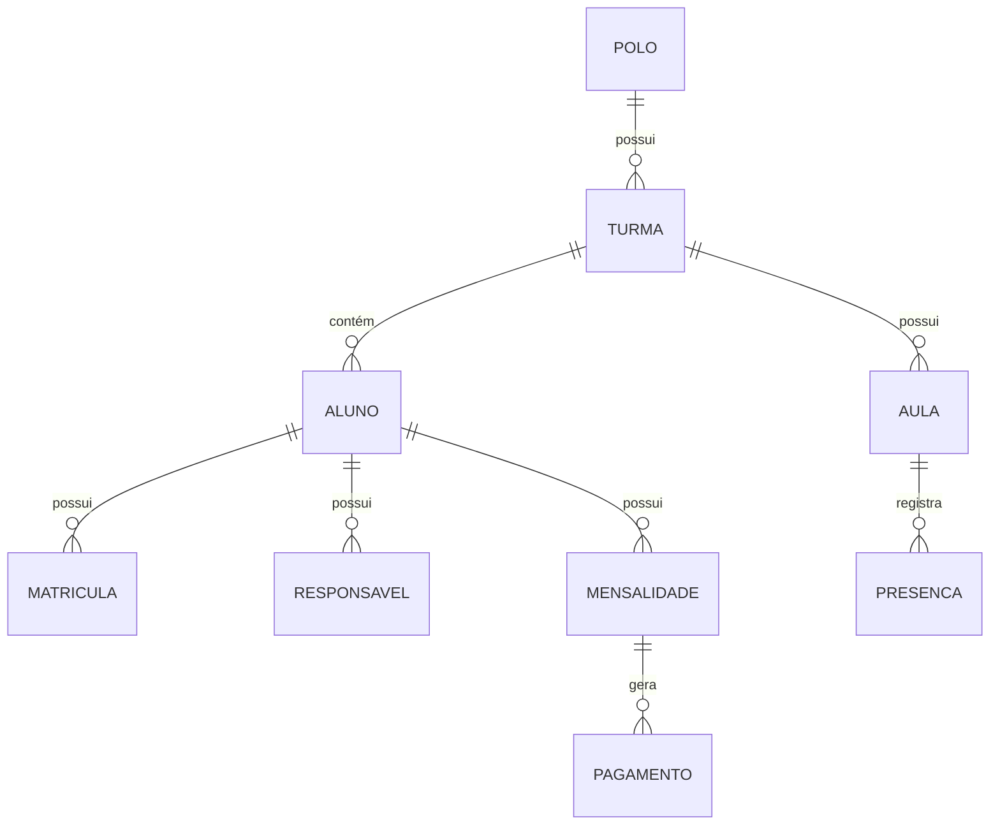

# Documento de Requisitos do Produto (PRD) - IBUC System

## 1. Visão Geral

### 1.1 Propósito
O IBUC System é uma plataforma de gestão educacional desenvolvida para o Instituto Bíblico Único Caminho, destinada a gerenciar cursos de teologia infanto-juvenil em múltiplos polos, oferecendo funcionalidades completas para matrículas, gestão de alunos, acompanhamento acadêmico e administrativo.

### 1.2 Escopo
- Gestão de polos e usuários
- Matrículas online e presenciais
- Controle de frequência
- Gestão acadêmica
- Financeiro e mensalidades
- Relatórios e análises
- LGPD e segurança de dados

## 2. Funcionalidades Principais

### 2.1 Módulo de Matrículas
- **Pré-matrícula online** com formulário digital
- Matrícula presencial com registro completo
- Upload de documentos
- Geração de termos de matrícula em PDF
- Aprovação e validação de documentos

### 2.2 Gestão de Alunos
- Cadastro completo de alunos e responsáveis
- Histórico acadêmico
- Documentos e certificados
- Comunicação com responsáveis
- Situação financeira

### 2.3 Acompanhamento Acadêmico
- Controle de frequência
- Lançamento de notas
- Boletins e relatórios
- Conteúdos e materiais didáticos
- Acompanhamento de desempenho

### 2.4 Gestão Financeira
- Controle de mensalidades
- Geração de boletos e cobranças
- Registro de pagamentos
- Relatórios financeiros
- Controle de inadimplência

### 2.5 Administrativo
- Gestão de usuários e permissões
- Controle de turmas e horários
- Calendário acadêmico
- Documentos e modelos
- Configurações do sistema

## 3. Requisitos Técnicos

### 3.1 Arquitetura
- **Frontend**: React 18 + TypeScript + Vite
- **Backend**: NestJS + TypeScript
- **Banco de Dados**: PostgreSQL (Supabase)
- **Autenticação**: Supabase Auth
- **Filas**: BullMQ + Redis
- **Documentação**: Swagger/OpenAPI

### 3.2 Segurança
- Autenticação JWT
- Row Level Security (RLS)
- Criptografia de dados sensíveis
- Logs de auditoria
- Conformidade com LGPD

## 4. Fluxos Principais

### 4.1 Fluxo de Matrícula Online
1. Acesso ao formulário de pré-matrícula
2. Preenchimento dos dados do aluno e responsável
3. Upload de documentos
4. Submissão e geração de protocolo
5. Análise e aprovação pela secretaria
6. Confirmação de matrícula
7. Geração de boleto da primeira mensalidade

### 4.2 Fluxo de Aula
1. Professor acessa lista de alunos
2. Registro de presença
3. Lançamento de atividades/avaliações
4. Acompanhamento de desempenho
5. Geração de relatórios

## 5. Regras de Negócio

### 5.1 Matrículas
- Idade mínima: 4 anos completos
- Documentação obrigatória: RG, CPF, comprovante de residência e foto 3x4
- Taxa de matrícula: R$ 50,00 (valor sujeito a alteração)

### 5.2 Frequência
- Frequência mínima: 75%
- Justificativas de falta devem ser enviadas em até 48h
- 3 faltas consecutivas sem justificativa geram notificação

### 5.3 Financeiro
- Mensalidade: R$ 120,00
- Vencimento: Todo dia 10
- Multa por atraso: 2% ao mês
- Juros: 1% ao mês

## 6. Requisitos Não-Funcionais

### 6.1 Desempenho
- Tempo de resposta médio: < 2s
- Suporte a 1000 usuários concorrentes
- Tempo de indisponibilidade máximo: 99,9% uptime

### 6.2 Usabilidade
- Interface responsiva
- Navegação intuitiva
- Tempo de aprendizado: máximo 1 hora
- Suporte a múltiplos dispositivos

### 6.3 Segurança
- Backup diário
- Criptografia em trânsito (HTTPS)
- Proteção contra injeção SQL
- Controle de acesso baseado em funções (RBAC)

## 7. Roadmap

### Fase 1 (MVP)
- [ ] Cadastro de alunos e responsáveis
- [ ] Matrículas online
- [ ] Controle de frequência
- [ ] Módulo financeiro básico

### Fase 2
- [ ] Portal do aluno
- [ ] Aplicativo móvel
- [ ] Integração com meios de pagamento
- [ ] Relatórios avançados

### Fase 3
- [ ] Gamificação
- [ ] Biblioteca virtual
- [ ] Aulas online
- [ ] Fórum de discussão

## 8. Métricas de Sucesso

### 8.1 Indicadores de Uso
- Número de matrículas mensais
- Taxa de conversão de pré-matrículas
- Frequência média dos alunos
- Tempo médio de uso diário

### 8.2 Indicadores Financeiros
- Inadimplência
- Taxa de renovação
- Custo de aquisição por aluno
- Ticket médio

## 9. Anexos

### 9.1 Modelo de Dados

### 9.2 Fluxos de Tela
- [Link para protótipos no Figma](#)

### 9.3 API Documentation
- [Documentação Swagger](/api/docs)

## 10. Histórico de Revisões

| Data | Versão | Descrição | Autor |
|------|--------|-----------|-------|
| 11/12/2025 | 1.0 | Versão inicial do PRD | IBUC Tech Team |

---
**IBUC - Instituto Bíblico Único Caminho**  
*Sistema desenvolvido com ❤️ para educação cristã*
